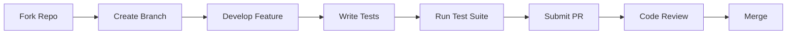

# 🚀 PyPozo 2.0 - Development Overview

## 📋 Project Status

**PyPozo 2.0** está listo para colaboración open source profesional! 🎉

### ✅ Completed Setup

- ✅ **Comprehensive Testing Suite** - Robust test framework with pytest
- ✅ **Contribution Guidelines** - Detailed CONTRIBUTING.md 
- ✅ **Issue & PR Templates** - GitHub automation templates
- ✅ **Code of Conduct** - Professional community guidelines
- ✅ **Security Policy** - Responsible disclosure and security practices
- ✅ **CI/CD Configuration** - GitHub Actions workflow
- ✅ **Documentation Structure** - Complete documentation framework

## 🏗️ Project Architecture

### 📂 Repository Structure

```
pypozo/
├── 📁 src/pypozo/           # Core source code
│   ├── core/               # Core functionality 
│   ├── petrophysics/       # Petrophysical calculations
│   ├── gui/                # PyQt5 GUI components
│   └── utils/              # Utility functions
├── 📁 tests/               # Complete test suite
│   ├── conftest.py         # Pytest fixtures
│   ├── test_core.py        # Core functionality tests
│   ├── test_petrophysics.py # Petrophysics tests
│   ├── test_gui.py         # GUI tests
│   ├── test_integration.py # End-to-end tests
│   ├── test_basic.py       # Basic environment tests
│   ├── test_quick_check.py # Quick validation tests
│   ├── run_tests.py        # Test runner script
│   └── README.md           # Testing documentation
├── 📁 data/                # Sample well data
├── 📁 docs/                # Documentation
├── 📁 examples/            # Usage examples
├── 📁 notebooks/           # Jupyter notebooks
├── 📁 .github/             # GitHub automation
│   ├── ISSUE_TEMPLATE/     # Issue templates
│   ├── workflows/          # CI/CD workflows
│   └── pull_request_template.md
└── 📄 Configuration files
    ├── CONTRIBUTING.md     # Contribution guidelines
    ├── CODE_OF_CONDUCT.md  # Community standards
    ├── SECURITY.md         # Security policy
    ├── CONTRIBUTORS.md     # Contributor recognition
    └── pytest.ini         # Test configuration
```

## 🧪 Testing Framework

### 🎯 Test Categories

| Test Type | File | Purpose | Status |
|-----------|------|---------|--------|
| **Environment** | `test_basic.py` | Verify dependencies | ✅ Ready |
| **Quick Check** | `test_quick_check.py` | Fast validation | ✅ Ready |
| **Core** | `test_core.py` | Core functionality | ✅ Ready |
| **Petrophysics** | `test_petrophysics.py` | Calculations | ✅ Ready |
| **GUI** | `test_gui.py` | User interface | ✅ Ready |
| **Integration** | `test_integration.py` | End-to-end | ✅ Ready |

### 🏃 Running Tests

```bash
# Complete test suite
python tests/run_tests.py

# Quick validation only
python tests/run_tests.py --basic-only

# Specific test categories
pytest tests/test_core.py -v
pytest tests/test_petrophysics.py -v
pytest tests/test_gui.py -v

# With coverage
pytest tests/ --cov=src --cov-report=html
```

## 🤝 Contribution Workflow

### 🆕 For New Contributors

1. **🍴 Fork** the repository
2. **📖 Read** [CONTRIBUTING.md](CONTRIBUTING.md)
3. **🏷️ Find** issues labeled `good first issue`
4. **💬 Comment** on the issue you want to work on
5. **🌿 Create** a feature branch
6. **🔧 Develop** your contribution
7. **🧪 Run** tests: `python tests/run_tests.py`
8. **📤 Submit** a pull request

### 🔄 Development Process



## 📊 Quality Standards

### ✅ Code Quality

- **🐍 Python Standards**: PEP 8 compliant
- **📝 Documentation**: Comprehensive docstrings
- **🧪 Test Coverage**: >80% coverage target
- **🔍 Type Hints**: Type annotations for public APIs
- **🚨 Security**: Security scanning with bandit
- **📋 Linting**: flake8, black, isort

### 🎯 PR Requirements

- [ ] Tests pass locally
- [ ] New tests for new functionality
- [ ] Documentation updated
- [ ] Code follows style guide
- [ ] Security considerations addressed
- [ ] Backward compatibility maintained

## 🔧 Development Setup

### 🛠️ Quick Start

```bash
# Clone repository
git clone https://github.com/your-username/pypozo.git
cd pypozo

# Create virtual environment
python -m venv venv
source venv/bin/activate  # Linux/Mac
# or
venv\Scripts\activate     # Windows

# Install dependencies
pip install -r requirements.txt
pip install -e .

# Install development tools
pip install pytest pytest-qt pytest-cov black flake8 mypy

# Verify installation
python tests/run_tests.py --basic-only
```

### 🔍 Development Tools

| Tool | Purpose | Command |
|------|---------|---------|
| **pytest** | Testing framework | `pytest tests/` |
| **black** | Code formatting | `black src/ tests/` |
| **flake8** | Linting | `flake8 src/ tests/` |
| **mypy** | Type checking | `mypy src/` |
| **bandit** | Security scanning | `bandit -r src/` |

## 🎯 Areas for Contribution

### 🌟 High Priority

- **🧪 Test Coverage**: Expand test coverage for edge cases
- **📚 Documentation**: Improve user documentation and tutorials
- **⚡ Performance**: Optimize calculation algorithms
- **🎨 UI/UX**: Enhance user interface design
- **🔌 Integrations**: Add support for more data formats

### 🚀 Feature Roadmap

| Feature | Priority | Complexity | Status |
|---------|----------|------------|--------|
| **Advanced VCL Methods** | High | Medium | 📋 Planned |
| **Facies Classification** | High | High | 💡 Concept |
| **3D Visualization** | Medium | High | 💡 Concept |
| **Cloud Integration** | Low | High | 🔮 Future |
| **Mobile App** | Low | High | 🔮 Future |

### 🆕 Good First Issues

Perfect for new contributors:

- 📝 **Documentation improvements**
- 🐛 **Bug fixes with clear reproduction steps**
- 🧪 **Additional test cases**
- 🎨 **UI/UX enhancements**
- 🔧 **Code refactoring**
- 📊 **New example notebooks**

## 🏆 Recognition Program

### 🎖️ Contributor Levels

| Level | Criteria | Benefits |
|-------|----------|----------|
| **🌱 Newcomer** | First contribution | Recognition in CONTRIBUTORS.md |
| **🌿 Regular** | 3+ contributions | Mention in release notes |
| **🌳 Maintainer** | Ongoing contributions | Write access to repository |
| **🏅 Core Team** | Leadership role | Decision-making authority |

### 🎉 Recognition

- **📝 Contributors file**: All contributors listed
- **🏷️ Release notes**: Significant contributions highlighted  
- **🎯 README badges**: Top contributors featured
- **🎪 Community events**: Special recognition at events

## 📈 Project Metrics

### 📊 Health Indicators

- **🧪 Test Coverage**: Target >80%
- **🐛 Bug Resolution**: <7 days average
- **📝 PR Review Time**: <3 days average
- **📚 Documentation**: Complete and up-to-date
- **🔒 Security**: No known vulnerabilities

### 📅 Release Cycle

- **🔄 Minor releases**: Monthly (2.1, 2.2, etc.)
- **🚀 Major releases**: Quarterly (3.0, 4.0, etc.)
- **🐛 Patch releases**: As needed (2.0.1, 2.0.2, etc.)
- **🔒 Security releases**: Immediate

## 🛡️ Security & Compliance

### 🔒 Security Measures

- **🔍 Automated scanning**: Daily dependency checks
- **🧪 Security tests**: Included in test suite
- **📋 Code review**: Required for all changes
- **🚨 Vulnerability response**: <24h for critical issues

### 📋 Compliance

- **⚖️ License**: MIT License (open source friendly)
- **🔐 Privacy**: No personal data collection
- **🌍 International**: GDPR compliant
- **🏢 Enterprise**: Corporate-friendly licensing

## 🌍 Community

### 💬 Communication Channels

- **🐛 GitHub Issues**: Bug reports and feature requests
- **💡 GitHub Discussions**: General community discussions
- **📧 Email**: Private security and maintainer contact
- **📱 Social Media**: Project updates and announcements

### 🎯 Community Goals

- **📈 Growth**: Sustainable community growth
- **🌍 Diversity**: Inclusive and diverse contributor base
- **🎓 Education**: Learning opportunities for all levels
- **🤝 Collaboration**: Strong industry partnerships
- **🏆 Excellence**: High-quality, reliable software

## 🔮 Future Vision

### 🎯 Long-term Goals

**PyPozo 2.0** aims to become the **leading open-source platform** for petrophysical analysis, providing:

- **🌍 Industry Standard**: Widely adopted in the oil & gas industry
- **🎓 Educational Tool**: Used in universities and training programs
- **🔬 Research Platform**: Advanced algorithms and methodologies
- **🤝 Community Hub**: Vibrant ecosystem of contributors and users
- **🚀 Innovation Driver**: Pushing the boundaries of petrophysical analysis

### 📊 Success Metrics

- **👥 Active Contributors**: 50+ regular contributors
- **⭐ GitHub Stars**: 1000+ stars
- **📦 Downloads**: 10K+ monthly downloads
- **🏢 Enterprise Adoption**: Used by major oil companies
- **🎓 Academic Use**: Adopted by 20+ universities

---

## 🚀 Getting Started

Ready to contribute? Here's your path:

1. **📚 Learn**: Read the [CONTRIBUTING.md](CONTRIBUTING.md)
2. **🔧 Setup**: Follow the development setup above
3. **🎯 Choose**: Pick an issue from our roadmap
4. **💻 Code**: Start developing your contribution
5. **🧪 Test**: Ensure all tests pass
6. **📤 Submit**: Create your first pull request

**Welcome to the PyPozo 2.0 community! 🎉**

---

*This document is maintained by the PyPozo core team. Last updated: [Date]*
*For questions or suggestions, please open an issue or contact the maintainers.*
