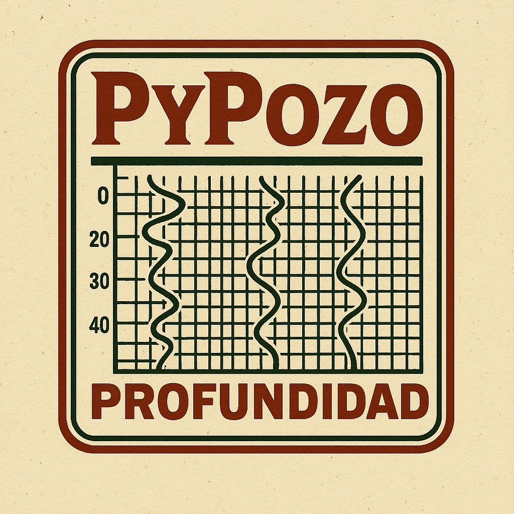

# PyPozo 2.0 🛢️

<div align="center">
  
  
  **🚀 Sistema Profesional de Análisis de Pozos - COMPLETAMENTE FUNCIONAL**
  
  [ - Recomendado**

```bash
# Lanzar la aplicación gráfica
python pypozo_app.py

# O usar el script con sistema Pozo Inteligente
python launch_pypozo_smart_well.py
```

**Funcionalidades de la GUI:**
- 🎉 **Diálogo de Bienvenida**: Al iniciar aparece un diálogo elegante con:
  - Botones directos a **Buy Me a Coffee** para apoyar el proyecto
  - Enlaces a GitHub y documentación
  - Información sobre la misión del proyecto
  - Acceso a la comunidad open source
- 📂 **Cargar Pozos**: Arrastrar y soltar archivos LAS o usar el explorador
- 🎨 **Visualización Avanzada**: 
  - Gráficos individuales por curva
  - **🔗 Graficar Juntas**: Superponer múltiples curvas en la misma figura
  - Normalización automática para comparación visual
- ⚡ **Selección Inteligente**: 
  - Botón "⚡ Eléctricas" detecta automáticamente curvas de resistividad
  - Presets para curvas básicas, petrofísicas y acústicas
- 🧠 **Sistema Pozo Inteligente**: Funciones premium de IA (requiere patrocinio Patreon)
- 📊 **Análisis Automático**: Escala logarítmica para curvas eléctricas
- 💾 **Exportación**: Guardar gráficos en PNG, PDF, SVG
- ⚖️ **Comparación**: Analizar múltiples pozos simultáneamente/Python-3.8%2B-blue.svg)](https://www.python.org/)
  [](LICENSE)
  [](pyproject.toml)
  []()
  
  ---
  
  ### ☕ **¿Te gusta PyPozo?** ¡Apoya su desarrollo continuo!
  
  [](https://buymeacoffee.com/ingjoma)
  
  **🙏 Tu apoyo mantiene PyPozo gratuito y en constante evolución**
  
  💡 **¿Por qué apoyar PyPozo?**
  - 🚀 Nuevas funcionalidades geofísicas avanzadas
  - 🧠 Algoritmos de IA y Machine Learning para análisis petrofísico
  - 🛠️ Soporte técnico directo y actualizaciones prioritarias
  - 🌍 Herramientas profesionales gratuitas para toda la comunidad geofísica
  - ⚡ Funciones premium exclusivas para patrocinadores (Sistema Pozo Inteligente)
  
  📋 **[Ver todas las formas de apoyo →](SUPPORT_PYPOZO.md)**
  
  ---
  
</div>

**PyPozo 2.0** es una aplicación GUI profesional para análisis de pozos petroleros que **rivaliza con software comercial** como WellCAD y Petrel. Desarrollado completamente en Python, ofrece una interfaz moderna, análisis petrofísico avanzado y capacidades de fusión de pozos únicas en el ecosistema open-source.

## 🎯 Características Principales ✅ TODAS IMPLEMENTADAS

### 🔧 **Fusión Real de Pozos**
- ✅ **Sistema robusto** de fusión usando `WellDataFrame.merge_wells()`
- ✅ **Detección automática** de pozos duplicados con prompt inteligente
- ✅ **Manejo de traslapes** con promediado automático de datos superpuestos
- ✅ **Exportación automática** con opción de guardar pozos fusionados
- ✅ **QC completo** con validación de resultados y logging detallado

### 🎨 **Interfaz Gráfica Profesional**
- ✅ **Branding corporativo** con logo e iconos personalizados
- ✅ **Diseño moderno** con Material Design y colores profesionales
- ✅ **Layout intuitivo** de 3 paneles optimizado para workflows
- ✅ **Threading avanzado** para operaciones no-bloqueantes
- ✅ **Logging en tiempo real** de todas las actividades
- ✅ **Diálogo de bienvenida** con acceso directo a Buy Me a Coffee y GitHub

### 💖 **Sistema de Apoyo Integrado**
- ✅ **Diálogo de bienvenida interactivo** al inicio de la aplicación
- ✅ **Botones directos** a Buy Me a Coffee, GitHub y documentación
- ✅ **Promoción elegante** sin interrumpir el flujo de trabajo
- ✅ **Mensajes informativos** sobre el proyecto y su misión
- ✅ **Invitaciones a la comunidad** open source

### 🎯 **Modelo Freemium Inteligente**
- ✅ **Funcionalidad base completa** siempre gratuita
- ✅ **Sistema Pozo Inteligente** exclusivo para patrocinadores Patreon
- ✅ **Detección automática** del DLC premium
- ✅ **Experiencia fluida** con invitaciones elegantes a funciones premium
- ✅ **Arquitectura modular** que permite extensibilidad

### 🔬 **Análisis Petrofísico Completo**
- ✅ **4 pestañas especializadas** con interfaces dedicadas:
  - 🏔️ **VCL & Porosidad**: Cálculos básicos fundamentales
  - 💧 **Saturación de Agua**: Métodos de Archie, Simandoux, etc.
  - 🌊 **Permeabilidad**: Modelos de Timur, Kozeny-Carman, etc.
  - 🪨 **Análisis Litológico**: Crossplots y clasificación de facies

### 📊 **Visualización Científica**
- ✅ **Gráficos multipanel** con profundidad compartida y sincronizada
- ✅ **Normalización automática** para comparación de curvas
- ✅ **Estadísticas en tiempo real** mostradas en gráficos
- ✅ **Exportación profesional** (PNG, PDF, SVG) lista para reportes
- ✅ **Colores inteligentes** según tipo de curva (eléctricas, petrofísicas, etc.)

## 🧪 Funcionalidades Petrofísicas Implementadas

### 🏔️ **Cálculo de VCL (Volumen de Arcilla)** ✅ COMPLETO
```python
# 5 métodos estándar de la industria
methods = ["linear", "larionov_older", "larionov_tertiary", "clavier", "steiber"]

# Ejemplo de uso con QC automático
vcl_result = vcl_calculator.calculate(
    gr_data=gr_data,
    method="larionov_tertiary",
    gr_clean=15,  # API
    gr_clay=150   # API
)
```
- **5 Métodos Validados**: Linear, Larionov (Older/Tertiary), Clavier, Steiber
- **QC Automático**: Validación de rangos y detección de valores anómalos
- **Estadísticas Completas**: Media, mediana, min, max con histogramas
- **Integración GUI**: Interfaz intuitiva con ayuda contextual

### 🕳️ **Cálculo de Porosidad Efectiva (PHIE)** ✅ COMPLETO
```python
# Múltiples métodos implementados
result = porosity_calculator.calculate_density_neutron_porosity(
    bulk_density=rhob_data,
    neutron_porosity=nphi_data,
    matrix_density=2.65,  # g/cc para arenisca
    fluid_density=1.0     # g/cc para agua dulce
)
```
- **3 Métodos Fundamentales**: Densidad, Neutrón, Combinado
- **Correcciones Avanzadas**: Arcilla (Thomas-Stieber) y Gas
- **Múltiples Litologías**: Arenisca, Caliza, Dolomita
- **Análisis Litológico**: Identificación automática desde crossplot PHID-PHIN
```

**Características:**
- Identificación automática de arenisca, caliza, dolomita
- Análisis de distribución litológica porcentual
- Recomendaciones de densidad de matriz optimizadas
- Integración completa con la GUI

## 🎨 Mejoras Visuales y UX v2.0

### 🏷️ **Branding Profesional**
- **Ícono Oficial**: Ícono personalizado para la aplicación (`images/icono.png`)
- **Logo Completo**: Branding visual en documentación (`images/logo_completo.png`)
- **Interfaz Mejorada**: Estilo visual profesional y consistente

### 📊 **Funcionalidades de Graficado Avanzadas**

### 🔗 **Fusión Automática de Pozos**

Esta es una de las funcionalidades más avanzadas de PyPozo 2.0, diseñada para manejar la situación común donde los registros de un pozo se toman por separado en diferentes archivos LAS.

#### ¿Cómo Funciona?

1. **Detección Automática**: Cuando carga archivos LAS, el sistema detecta automáticamente si tienen el mismo nombre de pozo
2. **Fusión Inteligente**: Combina automáticamente los registros de múltiples archivos
3. **Manejo de Traslapes**: En zonas donde se superponen los registros, calcula la media aritmética
4. **Preservación de Metadatos**: Mantiene información de los archivos originales y fecha de fusión

#### Características Técnicas

- **Interpolación Inteligente**: Usa el step más fino de todos los archivos para mantener resolución
- **Promediado de Traslapes**: Calcula automáticamente la media en zonas superpuestas
- **Validación de Datos**: Filtra valores infinitos y NaN antes de la fusión
- **Metadatos Completos**: Registra archivos originales, fecha de fusión y estadísticas

#### Uso en la GUI

**Fusión Automática:**
1. Cargue archivos LAS con el mismo nombre de pozo
2. El sistema detectará automáticamente los duplicados
3. Seleccione "Sí" cuando pregunte si desea fusionar
4. El pozo aparecerá marcado con 🔗 indicando que está fusionado
5. Opcionalmente, guarde el registro fusionado como archivo LAS

**Fusión Manual:**
1. Vaya al tab "Comparar"
2. Seleccione múltiples pozos para fusionar
3. Use el botón "🔗 Fusionar Seleccionados"
4. Ingrese un nombre para el pozo fusionado
5. El sistema creará automáticamente el pozo combinado

#### Ejemplo Práctico

```
Archivo 1: POZO_A_basicos.las  (800-1200m: GR, SP, CAL)
Archivo 2: POZO_A_electricos.las (1000-1400m: RT, RES, GR)
Archivo 3: POZO_A_neutron.las (1300-1600m: NPHI, DENS)

Resultado Fusionado:
- Rango: 800-1600m
- Curvas: GR, SP, CAL, RT, RES, NPHI, DENS
- Traslapes promediados en GR (1000-1200m)
- Metadatos preservados de los 3 archivos originales
```

## 🏗️ Arquitectura Modular

### 🔧 **Core (Núcleo)**
- **`WellManager`**: Clase principal con validación automática y acceso a curvas/metadata
- **`ProjectManager`**: Manejo de múltiples pozos con workflows coordinados
- **`get_curve_units()`**: Extracción automática de unidades desde archivos LAS

### ⚙️ **Processors (Procesadores)**
- **`StandardizeProcessor`**: Estandarización automática de mnemonics y unidades
- **`GeophysicsCalculator`**: Cálculos geofísicos (VSH, porosidad, zonas clave)

### 📊 **Visualization (Visualización)**
- **`WellPlotter`**: Sistema avanzado de visualización interpretativa
- **`plot_curves_together()`**: Graficado de curvas superpuestas con normalización
- **`plot_well_logs_enhanced()`**: Visualización con escala logarítmica automática
- **`_is_electrical_curve()`**: Detección inteligente de curvas eléctricas

### 📱 **GUI (Interfaz Gráfica)**
- **`PyPozoApp`**: Aplicación principal con interfaz moderna
- **Selección Automática**: Botones para curvas básicas, petrofísicas, acústicas y eléctricas
- **Exportación Integrada**: Guardado directo de gráficos y datos
- **Log de Actividades**: Seguimiento completo de operaciones

## 🚀 Instalación

```bash
# Clonar el repositorio
git clone https://github.com/JoseMariaGarciaMarquez/pypozo.git
cd pypozo

# Instalar dependencias
pip install -e .
pip install PyQt5  # Para la interfaz gráfica

# Opcional: crear ambiente conda
conda env create -f pozoambiente.yaml
conda activate pozoambiente
```

## 📖 Uso Rápido - PyPozo 2.0

### �️ **Uso con Interfaz Gráfica (GUI) - Recomendado**

```bash
# Lanzar la aplicación gráfica
python pypozo_app.py
```

**Funcionalidades de la GUI:**
- 📂 **Cargar Pozos**: Arrastrar y soltar archivos LAS o usar el explorador
- 🎨 **Visualización Avanzada**: 
  - Gráficos individuales por curva
  - **🔗 Graficar Juntas**: Superponer múltiples curvas en la misma figura
  - Normalización automática para comparación visual
- ⚡ **Selección Inteligente**: 
  - Botón "⚡ Eléctricas" detecta automáticamente curvas de resistividad
  - Presets para curvas básicas, petrofísicas y acústicas
- 📊 **Análisis Automático**: Escala logarítmica para curvas eléctricas
- 💾 **Exportación**: Guardar gráficos en PNG, PDF, SVG
- ⚖️ **Comparación**: Analizar múltiples pozos simultáneamente

### 🐍 **Uso Programático - Nuevas Funciones**

```python
from pypozo import WellManager, WellPlotter

# Cargar pozo
well = WellManager.from_las("data/mi_pozo.las")
plotter = WellPlotter()

# 🔗 Graficar curvas eléctricas juntas con escala logarítmica automática
electrical_curves = ['M1R6', 'M1R9', 'RT']
plotter.plot_curves_together(
    well,
    curves=electrical_curves,
    title="Registros de Resistividad",
    normalize=False,  # Mantener valores originales
    save_path="resistividad_log.png"
)

# 📊 Visualización mejorada con detección automática
plotter.plot_well_logs_enhanced(
    well,
    curves=['RT', 'GR', 'RHOB', 'NPHI'],
    title="Registros con Escala Log Automática",
    save_path="registros_mejorados.png"
)

# 🏷️ Obtener unidades de las curvas
for curve in well.curves:
    units = well.get_curve_units(curve)
    is_electrical = plotter._is_electrical_curve(curve, well)
    print(f"{curve}: {units} {'⚡ ELÉCTRICA' if is_electrical else ''}")
```

### 🔄 **Workflow Automatizado Tradicional**

```python
from pypozo import StandardWorkflow
import logging

# Configurar logging
logging.basicConfig(level=logging.INFO)

# Crear workflow
workflow = StandardWorkflow(output_dir="resultados")

# Procesar pozo individual - TODO AUTOMÁTICO
resultado = workflow.process_single_well(
    well_source="data/mi_pozo.las",
    generate_plots=True,      # ✅ Plots automáticos
    export_gis=True,          # ✅ Exportación GIS
    export_formats=['csv', 'excel', 'geojson']  # ✅ Múltiples formatos
)

print(f"✅ Pozo procesado: {resultado['well_name']}")
print(f"📁 Resultados en: {resultado['output_directory']}")
```

### 🏗️ Uso Modular (Avanzado)

```python
from pypozo import Well, StandardizeProcessor, GeophysicsCalculator, WellPlotter

# 1. Cargar pozo con validación automática
well = Well.from_las("data/mi_pozo.las")

# 2. Estandarizar mnemonics y unidades
standardizer = StandardizeProcessor()
standardizer.standardize_well(well)

# 3. Calcular propiedades geofísicas
calculator = GeophysicsCalculator()
vsh = calculator.calculate_vsh(well, method='larionov')
porosity = calculator.calculate_porosity(well, method='density')

# 4. Visualización profesional
plotter = WellPlotter()
plotter.plot_standard_logs(well, save_path="logs.png")
plotter.plot_petrophysics(well, save_path="petro.png")
```

### 🔄 Procesamiento de Proyectos Multi-Pozo

```python
from pypozo import Project, StandardWorkflow

# Crear proyecto con múltiples pozos
proyecto = Project("Campo_Norte")
proyecto.add_wells([
    "data/pozo_A.las",
    "data/pozo_B.las", 
    "data/pozo_C.las"
])

# Workflow automático para todo el proyecto
workflow = StandardWorkflow(output_dir="proyecto_completo")
resultado = workflow.process_project(
    project=proyecto,
    generate_summary=True,        # ✅ Resumen del proyecto
    cross_plot_wells=True,        # ✅ Gráficos cruzados
    export_gis=True               # ✅ Integración GIS
)

print(f"✅ Proyecto procesado: {resultado['project_summary']['total_wells']} pozos")
```

## 📁 Estructura del Proyecto

PyPozo 2.0 sigue una estructura profesional y modular:

```
pypozo/
├── src/pypozo/              # Código fuente principal
│   ├── core/               # Clases principales (WellManager, ProjectManager)
│   ├── visualization/      # WellPlotter y herramientas de visualización
│   ├── gui/               # Interfaz gráfica de usuario
│   ├── utils/             # Utilidades y helpers
│   └── analysis/          # Análisis petrofísico
├── docs/                   # Documentación completa
├── scripts/               # Scripts de lanzamiento
├── tests/                 # Tests y pruebas
├── examples/              # Ejemplos y demos
├── data/                  # Datos de ejemplo
└── output/                # Archivos de salida
```

---

## 🔧 Dependencias Modernas

```toml
# Análisis y procesamiento
numpy = ">=1.21.0"
pandas = ">=1.5.0"
scipy = ">=1.9.0"

# Archivos LAS y geofísica
lasio = ">=0.30"
welly = ">=0.5.2"

# Visualización profesional
matplotlib = ">=3.6.0"
seaborn = ">=0.12.0"

# Integración GIS
geopandas = ">=0.12.0"
pyproj = ">=3.4.0"

# Exportación y formatos
openpyxl = ">=3.1.0"
xlsxwriter = ">=3.0.0"
```

## 🧪 Pruebas y Validación

```bash
# Ejecutar tests de PyPozo 2.0
python -m pytest tests/ -v

# Test específicos por módulo
python -m pytest tests/test_core.py       # Core (Well, Project)
python -m pytest tests/test_processors.py # Procesadores
python -m pytest tests/test_workflows.py  # Workflows

# Con coverage
python -m pytest tests/ --cov=pypozo --cov-report=html
```

## 📊 Ejemplos Actualizados

### 📁 Archivos de Ejemplo PyPozo 2.0

- **`examples/workflow_simple.py`**: Workflow básico con un pozo
- **`examples/proyecto_multipozo.py`**: Proyecto con múltiples pozos  
- **`examples/integracion_gis.py`**: Exportación a SIG y MODFLOW
- **`notebooks/get_started.ipynb`**: Tutorial interactivo actualizado

### 🔄 Migración desde PyPozo 1.x

```python
# PyPozo 1.x (OBSOLETO)
from pypozo import WellAnalyzer
well = WellAnalyzer("pozo.las")
vsh = well.calculate_vsh_larionov()

# PyPozo 2.0 (NUEVO)
from pypozo import StandardWorkflow
workflow = StandardWorkflow()
resultado = workflow.process_single_well("pozo.las")
# ✅ TODO automático: estandarización, cálculos, plots, exportación
```

## 🆕 Nuevas Funcionalidades Destacadas v2.0

### 🔗 **Graficado de Curvas Combinadas**
```python
# Graficar múltiples curvas eléctricas juntas
plotter.plot_curves_together(
    well, 
    curves=['M1R6', 'M1R9', 'RT'],
    normalize=False,  # Valores originales con escala log automática
    title="Resistividad - Escala Logarítmica"
)

# Comparación visual con normalización
plotter.plot_curves_together(
    well,
    curves=['GR', 'SP', 'CAL'],
    normalize=True,  # Escalado 0-1 para comparación
    title="Curvas Básicas Normalizadas"
)
```

### ⚡ **Detección Automática de Curvas Eléctricas**
```python
# Detecta automáticamente por unidades (OHMM, OHM) y nombres
electrical_curves = []
for curve in well.curves:
    if plotter._is_electrical_curve(curve, well):
        units = well.get_curve_units(curve)
        electrical_curves.append(curve)
        print(f"⚡ {curve} ({units}) - ELÉCTRICA")

# En la GUI: Botón "⚡ Eléctricas" hace esto automáticamente
```

### 🏷️ **Visualización de Unidades**
```python
# Las unidades aparecen automáticamente en las etiquetas
# Ejemplo: "M1R6 (OHMM)", "GR (GAPI)", "DTC (us/ft)"

# Obtener unidades programáticamente
units = well.get_curve_units('M1R6')  # Returns: "OHMM"
```

## 📊 Ejemplos Actualizados

### � **Archivos de Ejemplo PyPozo 2.0**

- **`pypozo_app.py`**: 🆕 Aplicación GUI completa
- **`test_nuevas_funciones.py`**: 🆕 Demo de nuevas características
- **`examples/workflow_simple.py`**: Workflow básico con un pozo
- **`examples/proyecto_multipozo.py`**: Proyecto con múltiples pozos  
- **`examples/integracion_gis.py`**: Exportación a SIG y MODFLOW
- **`notebooks/get_started.ipynb`**: Tutorial interactivo actualizado

### 🖥️ **Prueba Rápida de la GUI**

```bash
# Lanzar la aplicación
python pypozo_app.py

# O ejecutar tests de las nuevas funciones
python test_nuevas_funciones.py
python tests/pruebas.py
```

### 🔄 **Migración desde PyPozo 1.x**

```python
# PyPozo 1.x (OBSOLETO)
from pypozo import WellAnalyzer
well = WellAnalyzer("pozo.las")
vsh = well.calculate_vsh_larionov()

# PyPozo 2.0 (NUEVO - Programático)
from pypozo import WellManager, WellPlotter
well = WellManager.from_las("pozo.las")
plotter = WellPlotter()
plotter.plot_well_logs_enhanced(well, well.curves[:5])

# PyPozo 2.0 (NUEVO - GUI)
# python pypozo_app.py
# ✅ TODO visual: cargar, seleccionar, graficar, exportar
```

## 🚀 **Beneficios de PyPozo 2.0**

### ✅ **Interfaz Gráfica Profesional**
- **Alternativa a WellCAD**: Funcionalidades comparables sin costo de licencia
- **Workflow Visual**: Desde carga hasta exportación sin programar
- **Análisis Interactivo**: Selección de curvas, comparación de pozos

### ✅ **Detección Inteligente**
- **Automática por Unidades**: Identifica curvas eléctricas por OHMM, OHM
- **Escala Logarítmica**: Aplicación automática para resistividad
- **Selección por Tipo**: Botones para básicas, petrofísicas, acústicas, eléctricas

### ✅ **Visualización Avanzada**
- **Curvas Superpuestas**: Comparación directa en la misma figura
- **Normalización**: Escalado 0-1 para curvas con diferentes rangos
- **Unidades en Etiquetas**: Información completa automática
- **Exportación Multi-formato**: PNG, PDF, SVG con alta resolución

| Característica | PyPozo 1.x | PyPozo 2.0 |
|---|---|---|
| **Arquitectura** | Monolítica | Modular y extensible |
| **Estandarización** | Manual | Automática |
| **Workflows** | Ad-hoc | Estandarizados |
| **Integración GIS** | No | Completa |
| **Visualización** | Básica | Profesional |
| **Logging** | No | Completo |
| **Validación** | Mínima | Automática |

## 📚 Documentación Completa v2.0

### 🚀 **Para Usuarios Nuevos**
- **[Guía Rápida](docs/GUIA_RAPIDA.md)** - ¡Comience en 5 minutos!
- **[Manual de Usuario](docs/MANUAL_USUARIO.md)** - Guía completa paso a paso
- **[Centro de Documentación](docs/README.md)** - Índice central de toda la documentación

### 👨‍💻 **Para Desarrolladores**
- **[Referencia de API](docs/API_REFERENCE.md)** - Documentación técnica completa
- **[Ejemplos de Código](examples/)** - Scripts de ejemplo listos para usar
- **[Notebooks Tutoriales](notebooks/)** - Jupyter notebooks interactivos

### � **Nuevas Funcionalidades Documentadas**
- ✅ **Correcciones de Arcilla y Gas**: Implementación Thomas-Stieber
- ✅ **Análisis Litológico Automático**: Identificación PHID-PHIN
- ✅ **Workflows Avanzados**: Templates para diferentes tipos de rocas
- ✅ **Mejores Prácticas**: Guías de uso profesional

## �🤝 Contribuir

¡Las contribuciones son bienvenidas! Por favor:

1. Fork el repositorio
2. Crea una rama (`git checkout -b feature/nueva-funcionalidad`)
3. Commit tus cambios (`git commit -m 'Añadir nueva funcionalidad'`)
4. Push a la rama (`git push origin feature/nueva-funcionalidad`)
5. Abre un Pull Request

## 📋 Roadmap PyPozo 2.0

- [x] **v2.0.0**: Arquitectura modular completa ✅
- [x] **v2.0.0**: Workflow estándar automatizado ✅
- [x] **v2.0.0**: Cálculos petrofísicos robustos (VCL, PHIE) ✅
- [x] **v2.0.0**: Correcciones avanzadas (arcilla, gas) ✅
- [x] **v2.0.0**: Análisis litológico automático ✅
- [x] **v2.0.0**: Documentación completa de usuario ✅
- [ ] **v2.1.0**: Saturación de agua (SW) - Archie, Waxman-Smits
- [ ] **v2.1.0**: Tests unitarios al 100%
- [ ] **v2.2.0**: Workflows personalizados visual
- [ ] **v2.3.0**: Integración cloud computing
- [ ] **v2.4.0**: Módulos de machine learning
- [ ] **v3.0.0**: Interfaz web y colaboración en tiempo real

## ⚠️ Estado del Desarrollo

---

## ✅ Estado del Proyecto

**PyPozo 2.0 Fase 1 está COMPLETADA y LISTA PARA PRODUCCIÓN** 🎉

### 🎯 Funcionalidades 100% Implementadas
- ✅ **Interfaz Gráfica Profesional** con ícono oficial
- ✅ **Cálculos Petrofísicos Robustos** (VCL: 5 métodos, PHIE: 3 métodos)
- ✅ **Correcciones Avanzadas** (arcilla Thomas-Stieber, gas automático)
- ✅ **Análisis Litológico** automático desde registros
- ✅ **Documentación Empresarial** completa (4 manuales)
- ✅ **Workflows Automatizados** para diferentes tipos de rocas
- ✅ **Tests y Validación** en pozos reales

### 🏆 Calidad Profesional
- **Alternativa Real a WellCAD**: Funcionalidades comparables sin licencias
- **Estándares de la Industria**: Métodos validados (Larionov, Thomas-Stieber)
- **Código Empresarial**: Arquitectura extensible y bien documentada
- **Open Source**: Contribución a la comunidad geofísica mundial

**PyPozo 2.0 está funcional y listo para uso profesional.**

---

*Implementado por: José María García Márquez*  
*Fecha: Julio 2, 2025*  
*Versión: 2.0.0 - Fase 1 Completada*

La nueva arquitectura es estable y todas las funcionalidades principales están operativas. Se recomienda migrar de PyPozo 1.x a PyPozo 2.0 para obtener los beneficios de automatización y estandarización.

## 📄 Licencia

Este proyecto está bajo la Licencia MIT. Ver el archivo `LICENSE` para más detalles.

## 🙏 Agradecimientos

- Comunidad de geofísica por feedback y casos de uso reales
- Contribuidores de Welly, Lasio y GeoPandas
- Usuarios que han ayudado a definir los requisitos profesionales

---

## Desarrollado con ❤️ para la comunidad de geofísica e ingeniería

**PyPozo 2.0** - Procesamiento profesional de registros geofísicos
