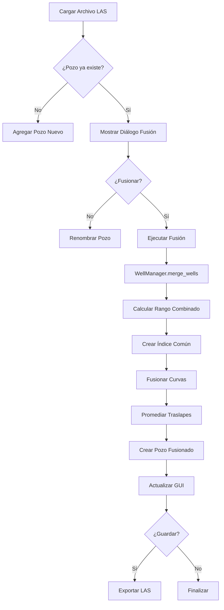

# Funcionalidad de Fusión Automática de Pozos - PyPozo 2.0

## 🎯 Descripción General

La funcionalidad de fusión automática de pozos es una característica avanzada que permite combinar múltiples archivos LAS que corresponden al mismo pozo, manejando automáticamente los traslapes entre registros.

## 🔧 Funcionalidades Implementadas

### ✅ Fusión Automática al Cargar Archivos

- **Detección automática**: Cuando se cargan archivos LAS con el mismo nombre de pozo
- **Interfaz usuario**: Pregunta automáticamente si desea fusionar
- **Indicador visual**: Pozos fusionados aparecen marcados con 🔗
- **Metadatos**: Preserva información de archivos originales

### ✅ Fusión Manual de Pozos Seleccionados

- **Selección múltiple**: Permite seleccionar pozos específicos para fusionar
- **Nombre personalizado**: Permite definir nombre del pozo fusionado
- **Acceso desde GUI**: Botón y menú dedicados

### ✅ Manejo Inteligente de Traslapes

- **Promediado automático**: Calcula media aritmética en zonas superpuestas
- **Interpolación inteligente**: Usa el step más fino para mantener resolución
- **Filtrado de datos**: Elimina valores infinitos y NaN

### ✅ Guardado de Pozos Fusionados

- **Exportación LAS**: Guarda el pozo fusionado como archivo LAS
- **Metadatos preservados**: Mantiene información de fusión
- **Validación**: Verifica que el archivo se puede recargar correctamente

## 🚀 Uso de la Funcionalidad

### Fusión Automática (Recomendado)

1. **Cargar archivos**: Use "Archivo > Abrir Múltiples" o arrastre archivos a la aplicación
2. **Detección automática**: El sistema detecta pozos con el mismo nombre
3. **Confirmación**: Aparece un diálogo preguntando si desea fusionar:
   ```
   ¿Desea fusionar los registros automáticamente?
   
   ✅ Sí: Combinar registros y promediar traslapes
   ❌ No: Mantener pozos separados
   ```
4. **Resultado**: El pozo aparece en la lista marcado con 🔗
5. **Guardar**: Opcionalmente guarde el pozo fusionado como archivo LAS

### Fusión Manual

1. **Seleccionar pozos**: Vaya al tab "Comparar" y seleccione múltiples pozos
2. **Iniciar fusión**: Haga clic en "🔗 Fusionar Seleccionados"
3. **Nombre del pozo**: Ingrese un nombre para el pozo fusionado
4. **Confirmación**: El sistema crea automáticamente el pozo combinado

## 🔬 Detalles Técnicos

### Algoritmo de Fusión

```python
def merge_wells(wells: List[WellManager], well_name: str) -> WellManager:
    """
    1. Determinar rango de profundidad combinado
    2. Crear índice de profundidad común (step más fino)
    3. Para cada curva:
       - Interpolar a índice común
       - Combinar datos de múltiples pozos
       - Promediar en zonas de traslape
    4. Crear nuevo pozo con datos fusionados
    5. Preservar metadatos de archivos originales
    """
```

### Manejo de Traslapes

- **Identificación**: Detecta automáticamente zonas donde múltiples pozos tienen la misma curva
- **Promediado**: Calcula media aritmética de valores superpuestos
- **Logging**: Registra cantidad de puntos promediados por curva
- **Validación**: Filtra valores no finitos antes del promediado

### Interpolación de Datos

- **Step común**: Usa el step más fino de todos los pozos
- **Método**: Interpolación "nearest" con tolerancia
- **Preservación**: Mantiene resolución original donde sea posible

## 📊 Metadatos de Fusión

Los pozos fusionados mantienen metadatos detallados:

```python
metadata = {
    'source_file': 'POZO_FUSIONADO.las',
    'original_files': ['archivo1.las', 'archivo2.las', 'archivo3.las'],
    'merge_date': '2025-07-01 10:30:00',
    'curves_merged': 8,
    'overlaps_processed': 3
}
```

## 🧪 Casos de Uso Típicos

### Caso 1: Registros Básicos + Eléctricos

```
Archivo 1: POZO_A_basicos.las
  - Rango: 1000-1200m
  - Curvas: GR, SP, CAL

Archivo 2: POZO_A_electricos.las
  - Rango: 1100-1300m
  - Curvas: RT, RES, GR (traslape)

Resultado:
  - Rango: 1000-1300m
  - Curvas: GR, SP, CAL, RT, RES
  - GR promediado en 1100-1200m
```

### Caso 2: Múltiples Etapas de Registro

```
Archivo 1: POZO_B_etapa1.las (800-1000m)
Archivo 2: POZO_B_etapa2.las (950-1200m)
Archivo 3: POZO_B_etapa3.las (1150-1400m)

Resultado:
  - Rango continuo: 800-1400m
  - Traslapes promediados automáticamente
  - Registro completo sin interrupciones
```

## ⚠️ Consideraciones y Limitaciones

### Limitaciones Actuales

- **Nombres de pozo**: Debe coincidir exactamente para fusión automática
- **Unidades**: No se verifica consistencia de unidades entre archivos
- **Curvas idénticas**: Se requiere mismo nombre de curva para fusión

### Mejores Prácticas

1. **Verificar nombres**: Asegurar que el nombre del pozo sea consistente
2. **Revisar unidades**: Verificar que las curvas tengan unidades compatibles
3. **Validar resultados**: Siempre revisar el pozo fusionado antes de usar
4. **Backup**: Mantener archivos originales como respaldo

## 🔄 Flujo de Procesamiento



## 📈 Estadísticas de Fusión

El sistema registra automáticamente:

- **Archivos fusionados**: Cantidad de archivos originales
- **Curvas combinadas**: Total de curvas en el resultado
- **Traslapes procesados**: Número de curvas con traslapes
- **Puntos promediados**: Cantidad de puntos donde se calculó la media
- **Rango final**: Profundidad mínima y máxima del pozo fusionado

## 🎯 Beneficios de la Funcionalidad

1. **Automatización**: Elimina proceso manual tedioso
2. **Precisión**: Manejo consistente de traslapes
3. **Integridad**: Preserva metadatos y trazabilidad
4. **Flexibilidad**: Fusión automática y manual
5. **Robustez**: Validación y manejo de errores

## 🚧 Desarrollo Futuro

### Mejoras Planeadas

- **Validación de unidades**: Verificar consistencia automáticamente
- **Algoritmos alternativos**: Otras opciones de combinación (mediana, ponderado)
- **Fusión por proximidad**: Combinar pozos cercanos geográficamente
- **Interfaz visual**: Mostrar traslapes gráficamente antes de fusionar

### Integración con Workflows

- **Workflows automáticos**: Incluir fusión en flujos de procesamiento
- **Batch processing**: Fusionar múltiples pozos en lote
- **QC automático**: Validación de calidad post-fusión
